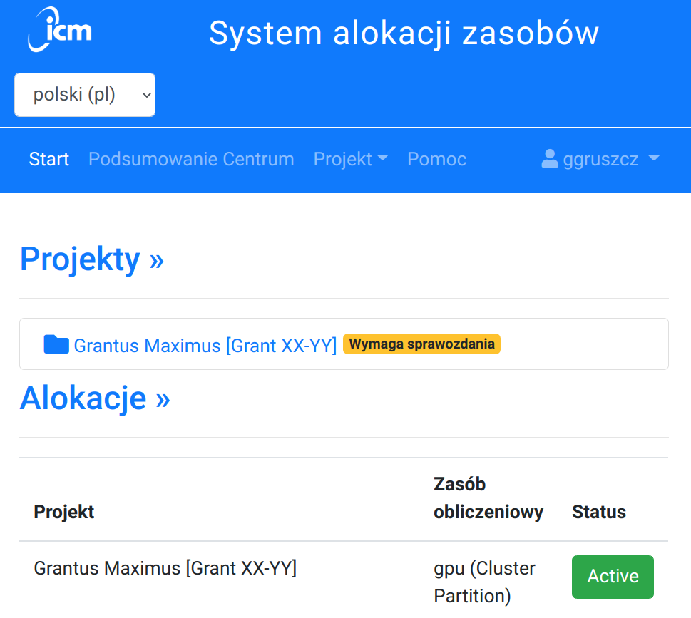
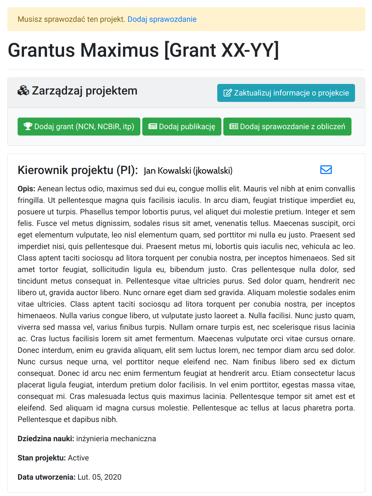
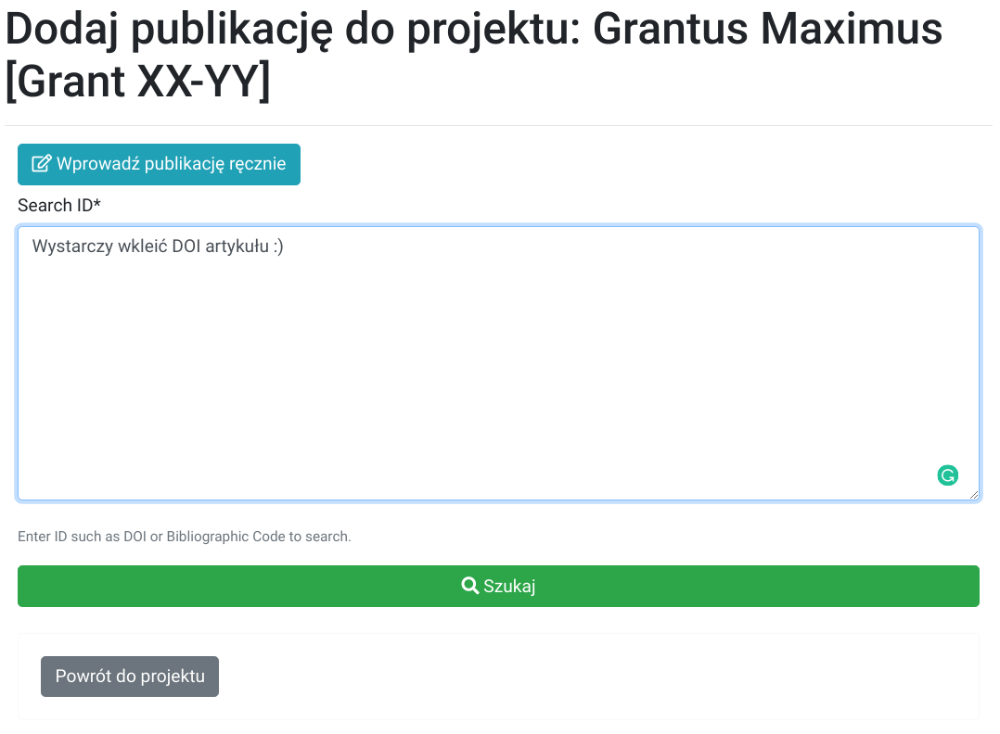

# Rozliczenie Grantu

Rozliczanie grantu odbywa się raz do roku, najczęściej na przełomie
marca/kwietnia.
Przypomnienie o konieczności złożenia sprawozdania przesyłane jest mailem do wszystkich kierowników
grantów.

Zadaniem kierownika jest podsumowanie obliczeń w grancie prowadzonych
przez jego wykonawców i uzasadnienie wykorzystania zasobów ICM.

## Sprawozdanie

Sprawozdanie powinno być podsumowaniem działań i powinno zawierać
informacje dotyczące:

  - wyników obliczeń
  - wykorzystanego oprogramowania
  - informacji o maszynach na których prowadzone były obliczenia
  - czas wykorzystania zasobów (CPU)
  - praktycznych informacji o obliczeniach na maszynach ICM
  - możliwości stosowania obliczeń równoległych
  - innych grantów (NCN, NCBiR, FP7 i inne) w których wykorzystywane są
    obliczenia prowadzone w ICM
  - publikacje związane z grantem

Warto pamiętać o sprawdzeniu:

  - streszczenia grantu
  - danych kontaktowych do kierownika oraz
    współwykonawców grantu

### Publikacje

Wszystkie publikacje związane z grantem obliczeniowym powinny być
zamieszczane w bazie grantów oraz zawierać następującą informację:

!!! Info
    Obliczenia zostały wykonane przy wsparciu Interdyscyplinarnego Centrum
    Modelowania Matematycznego i Komputerowego (ICM) Uniwersytetu Warszawskiego 
    w ramach grantu obliczeniowego nr Gxx-xx

    lub 

    This research was carried out with the support of the
    Interdisciplinary Centre for Mathematical and Computational Modelling
    ICM) University of Warsaw under grant no Gxx-xx

## Jak złożyć sprawozdanie

Od 2021r. sprawozdanie należy składać poprzez `System alokacji zasobów`. [TODO: LINK] 

Poniżej szczegółowa instrukcja.

  

- Logujemy się korzystając z nazwy użytkownika i hasła takiego jak na serwer dostępowy (`hpc.icm.edu.pl`). 

  

- Wybieramy projekty które wymagają sprawozdania.

  

- Uzupełniamy dane: Streszczenie, Grant (NCN, NCBiR, itp), Publikacje oraz Sprawozdanie.

  

- Warto zauważyć, że w celu dodania publikacji wystarczy jej DOI.

  

- Gotowe. Po uzupełnieniu pól nie trzeba nic więcej robić. Dziękujemy.

!!! note "Dlaczego sprawozdania są ważne?"
    Sprawozdania służą do pozyskiwania oraz rozliczania środków finansowych przeznaczonych na rozbudowę, utrzymanie Centrum Obliczeniowego (w tym zakup serwerów obliczeniowych) i dostęp do możliwości obliczeniowych (koszty energii, serwis techniczny, wynagrodzenia itp).

