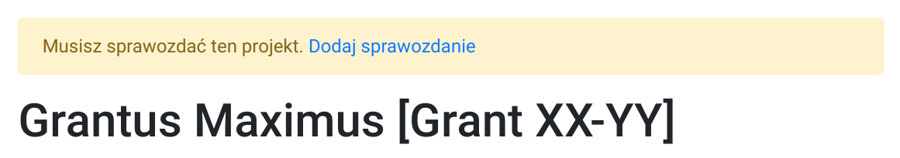

# Rozliczenie Grantu

Rozliczanie grantu odbywa się raz do roku, najczęściej na przełomie marca/kwietnia.
Przypomnienie o konieczności złożenia sprawozdania przesyłane jest mailem do wszystkich kierowników grantów.

Zadaniem kierownika jest podsumowanie obliczeń w grancie prowadzonych
przez jego wykonawców i uzasadnienie wykorzystania zasobów ICM.

## Po co składać sprawozdanie

!!! info "Dlaczego sprawozdania są ważne?"
    Sprawozdania służą do pozyskiwania oraz rozliczania środków finansowych przeznaczonych na rozbudowę, utrzymanie Centrum Obliczeniowego (w tym zakup serwerów obliczeniowych) i dostęp do możliwości obliczeniowych (koszty energii, serwis techniczny, wynagrodzenia itp).

    Nie złożenie sprawozdania przez kierownika grantu może skutkować zamknięciem grantu.

    Wam i Nam zależy aby obliczenia naukowe odbywały się niekomercyjnie.

## Jak przygotować sprawozdanie

Sprawozdanie powinno zawierać:

- podsumowanie działań i wyników obliczeń
- informacje o wykorzystywanym oprogramowaniu
- informacje o maszynach na których prowadzone były obliczenia
- ilość wykorzystanych zasobów (CPUh)
- informację o możliwości stosowania obliczeń równoległych
- krótką informacje o grantach (NCN, NCBiR, FP7 i inne) w których wykorzystywane są obliczenia prowadzone w ICM
- publikacje związane z grantem obliczeniowym

Warto pamiętać o sprawdzeniu:

- streszczenia grantu
- danych kontaktowych do kierownika oraz współwykonawców grantu

### Publikacje

Wszystkie publikacje związane z grantem obliczeniowym powinny być
zamieszczane w bazie grantów oraz zawierać następującą informację:

!!! Info
    Obliczenia zostały wykonane przy wsparciu Interdyscyplinarnego Centrum
    Modelowania Matematycznego i Komputerowego (ICM) Uniwersytetu Warszawskiego 
    w ramach grantu obliczeniowego nr Gxx-xx

    lub 

    This research was carried out with the support of the
    Interdisciplinary Centre for Mathematical and Computational Modelling
    ICM) University of Warsaw under grant no Gxx-xx

## Jak złożyć sprawozdanie

Od 2021r. sprawozdanie należy składać poprzez [System alokacji zasobów](https://owugate.nebula.grid.icm.edu.pl/sprawozdania/user/login).

Poniżej szczegółowa instrukcja.

### Logowanie

Logujemy się korzystając z nazwy użytkownika i hasła takiego jak na serwer dostępowy (`hpc.icm.edu.pl`).

  

### Wybór projektu

Wybieramy projekty które wymagają sprawozdania.

  

### Streszczenie Projektu

W celu uzupełnienia streszczenia należy kliknąć w 'Zaktualizuj informacje o projekcie'.

  

### Publikacje

Warto zauważyć, że w celu dodania publikacji wystarczy jej DOI.

  

### Sprawozdanie

Uzupełniamy pozostałe dane: Grant (NCN, NCBiR, itp), Publikacje oraz Sprawozdanie.

  

### Wyślij sprawozdanie

W celu wysłania sprawozdania należy kliknąć w link `Dodaj sprawozdanie` na górze strony.

  

### Zatwierdź

Zatwierdzamy sprawozdanie.

  

Gotowe.
