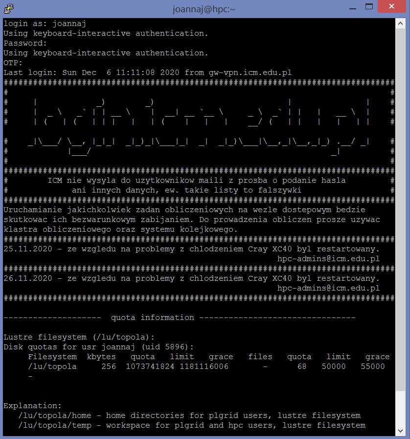

## Dostęp do ICM z komputera z systemem Windows

### Logowanie z poziomu terminala

Współczesne wersje systemu Windows 10 udostępniają klient ssh z poziomu PowerShell (interpreter poleceń) w trybie tekstowym. Po uruchomieniu okna PowerShell wykonujemy komendę `ssh hpc.icm.edu.pl` i dalej postępujemy zgodnie z instrukcją ze strony [Logowanie SSH](./ssh.md).

### Klient graficzny (PuTTY)
Ściągamy program PuTTY, dostępny pod adresem (jest to gotowy do
    użycia plik wykonywalny):

<http://the.earth.li/~sgtatham/putty/latest/x86/putty.exe>

Uruchamiamy ściągnięty program.
Pokazuje się okienko podobne do poniższego:

  

- W polu **Host Name (or IP address)** wpisujemy **hpc.icm.edu.pl**
    (adres maszyny dostępowej) i klikamy w przycisk **Open**.

- Przy pierwszym logowaniu pojawi się okno z komunikatem dotyczącym
    klucza dostępu. Należy zatwierdzić klucz wybierając opcję `TAK`

Autoryzacja jest dwu-składnikowa (2FA). Pojawia się terminal, w którym proszeni jesteśmy o podanie:

- nazwy użytkownika i hasła
- [OTP](ssh.md) (one time password, patrz [autoryzacja dwu-składnikowa](./ssh.md))

  

Po wpisaniu obu wartości znajdujemy się na komputerze dostępowym *hpc.icm.edu.pl*
(komputer ten może występować też pod nazwą *hpc*):

  

Komputery w sieci ICM wyposażone są w systemy operacyjne z rodziny UNIX.
